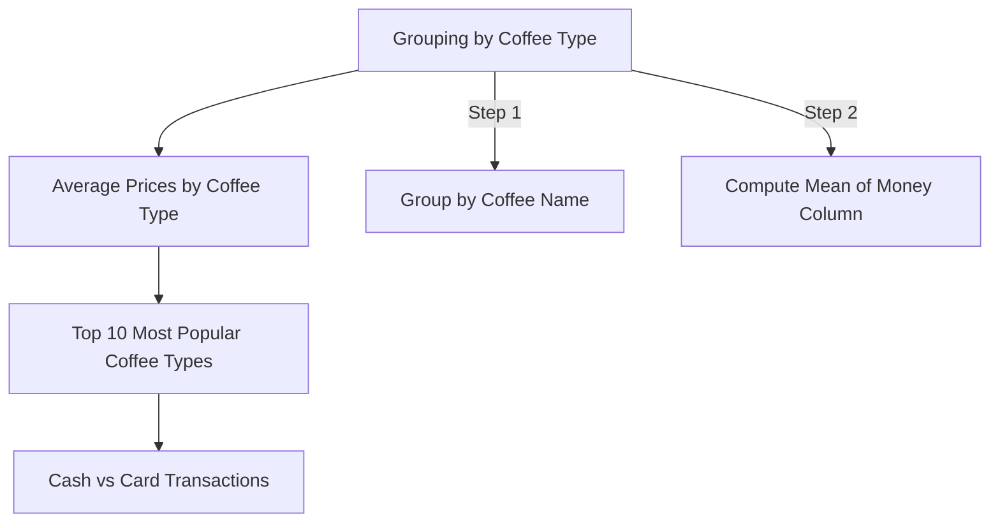
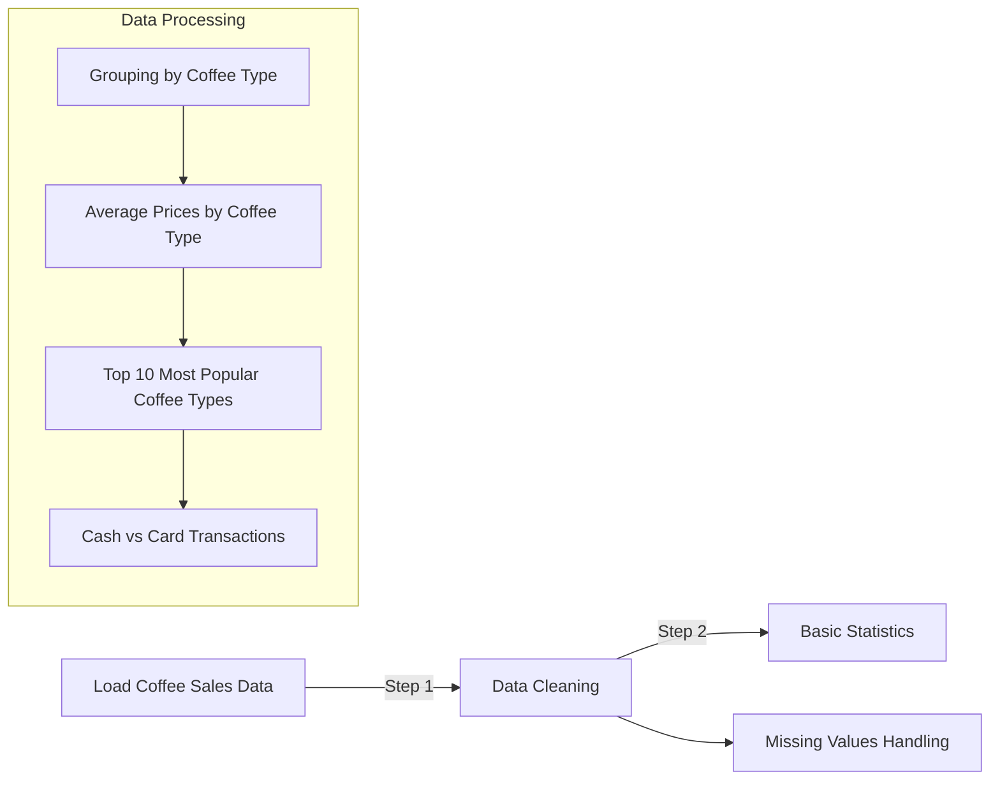
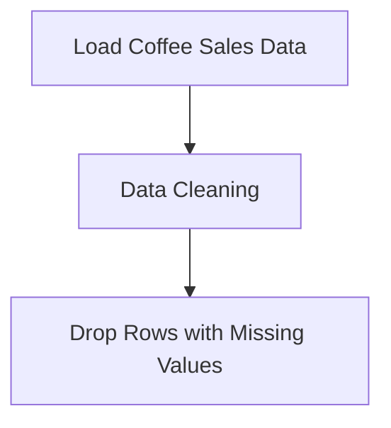

```mermaid
graph TD
    D[Grouping by Coffee Type] --> E[Average Prices by Coffee Type]
    D -->|Step 1| E1[Group by Coffee Name]
    D -->|Step 2| E2[Compute Mean of Money Column]
    E --> F[Top 10 Most Popular Coffee Types]
    F --> G[Cash vs Card Transactions]
```

```mermaid
graph LR
    A[Load Coffee Sales Data] -->|Step 1| B[Data Cleaning]
    B -->|Step 2| C[Basic Statistics]
    B --> D[Missing Values Handling]
    
    subgraph Data Processing
        E[Grouping by Coffee Type] --> F[Average Prices by Coffee Type]
        F --> G[Top 10 Most Popular Coffee Types]
        G --> H[Cash vs Card Transactions]
    end
```
<details>
<summary>Click to view Data Cleaning Process</summary>


```mermaid
graph TD
    A[Load Coffee Sales Data] --> B[Data Cleaning]
    B --> B1[Drop Rows with Missing Values]
```
```

</details>
