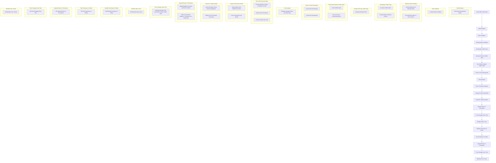

```mermaid
graph TD
    A[Load Coffee Sales Data] --> B[Data Cleaning]
    B --> C[Basic Statistics]
    C --> D[Missing Values Handling]
    D --> E[Grouping by Coffee Type]
    E --> F[Average Prices by Coffee Type]
    F --> G[Top 10 Most Popular Coffee Types]
    G --> H[Cash vs Card Transactions]
    H --> I[Price Analysis]
    I --> J[Time of Purchase Analysis]
    J --> K[Seasonal Trends per Month]
    K --> L[Customer Loyalty Analysis]
    L --> M[Special Events or Promotions]
    M --> N[Price Changes Over Time]
    N --> O[Monthly Sales Trend]
    O --> P[Monthly Purchases of Coffee]
    P --> Q[Top Purchasers of Coffee]
    Q --> R[Special Events or Promotions]
    R --> S[Price Changes Over Time]
    S --> T[Monthly Price Trends]

    subgraph Data Cleaning
        B1[Drop Rows with Missing Values]
    end

    subgraph Basic Statistics
        C1[Compute Basic Statistics]
    end

    subgraph Missing Values Handling
        D1[Create DataFrame of Missing Values]
        D2[Count Missing Values in Each Column]
    end

    subgraph Grouping by Coffee Type
        E1[Group by Coffee Name]
        E2[Compute Mean of Money Column]
    end

    subgraph Average Prices by Coffee Type
        F1[Calculate Average Prices]
    end

    subgraph Top 10 Most Popular Coffee Types
        G1[Count Coffee Types]
        G2[Sort by Count in Descending Order]
    end

    subgraph Cash vs Card Transactions
        H1[Count Cash Transactions]
        H2[Count Card Transactions]
    end

    subgraph Price Analysis
        I1[Calculate Average Prices by Coffee Type]
    end

    subgraph Time of Purchase Analysis
        J1[Convert DateTime Column to Datetime Format]
        J2[Extract Hour of Purchase]
        J3[Count Purchases per Hour]
    end

    subgraph Seasonal Trends per Month
        K1[Extract Month from DateTime Column]
        K2[Count Transactions per Month]
    end

    subgraph Customer Loyalty Analysis
        L1[Count How Many Times Each Card Appears]
        L2[Display Top 10 Frequent Customers]
    end

    subgraph Special Events or Promotions
        M1[Identify Multiple Purchases by Same Customer]
        M2[Filter for Customers Making 3+ Purchases in a Single Day]
    end

    subgraph Price Changes Over Time
        N1[Calculate Average Price per Month for Each Coffee Type]
    end

    subgraph Monthly Sales Trend
        O1[Plot Monthly Sales Trend]
    end

    subgraph Monthly Purchases of Coffee
        P1[Plot Monthly Purchases of Coffee]
    end

    subgraph Top Purchasers of Coffee
        Q1[Plot Top Purchasers of Coffee]
    end

    subgraph Special Events or Promotions
        R1[Plot Special Events or Promotions]
    end

    subgraph Price Changes Over Time
        S1[Plot Price Changes Over Time]
    end

    subgraph Monthly Price Trends
        T1[Plot Monthly Price Trends]
    end
```
